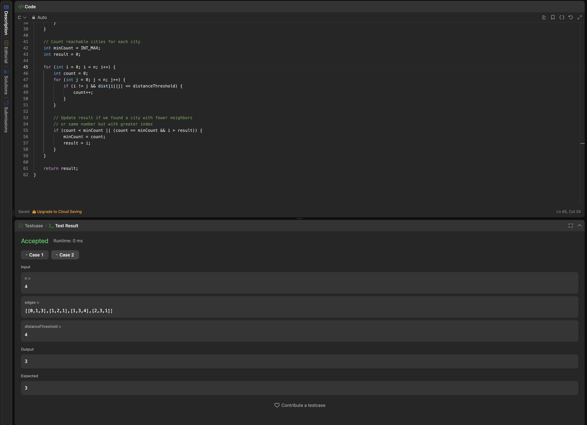
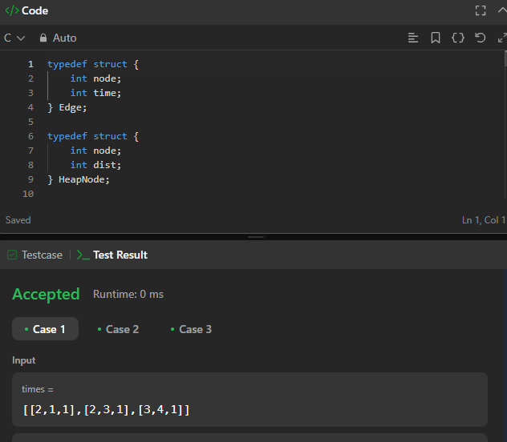
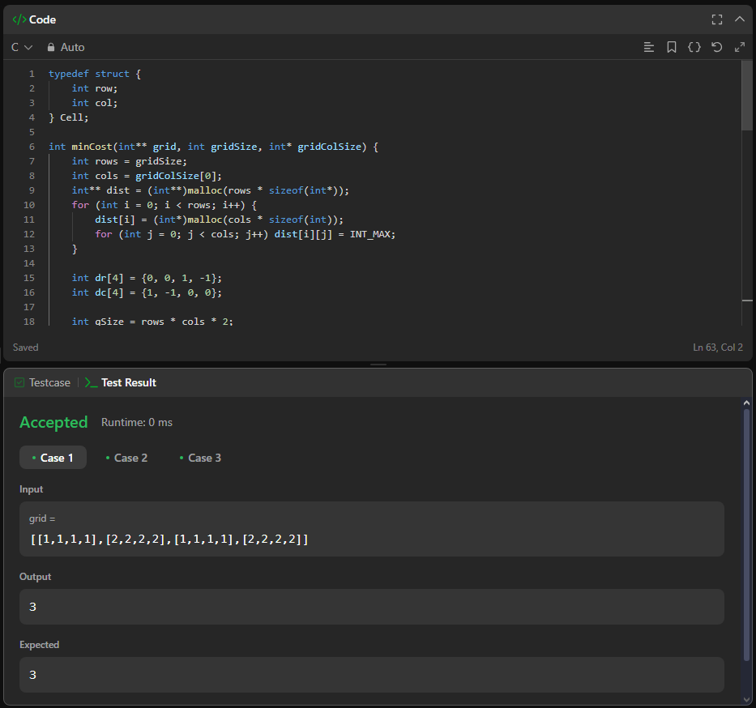
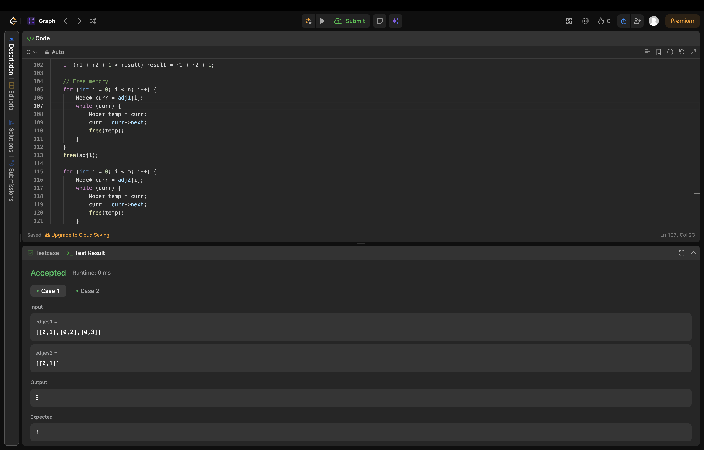

# Grafos2_Dupla_Leetcode
# Grafos 2 - Lista 2

## 📋 Informações do Projeto
**Disciplina:** Grafos 2  
**Número da Lista:** 2  
**Linguagem:** C

## 👥 Alunos
| Nome | Matrícula |
|------|-----------|
| Patrick Anderson Carvalho dos Santos | 211030620 |
| Vinícius Eduardo Muniz da Silva | 211031870 |

## 📖 Sobre
Resolução de exercícios do LeetCode de acordo com as condições propostas pelo professor em sala de aula.

## Exercícios
Serão realizados 4 exercícios, sendo 2 de nível Médio e 2 de nível Difícil.

| Nome | Dificuldade | Link Resolução |
|------|-------------|----------------|
| [1334. Find the City With the Smallest Number of Neighbors at a Threshold Distance](https://leetcode.com/problems/find-the-city-with-the-smallest-number-of-neighbors-at-a-threshold-distance/description/?envType=problem-list-v2&envId=graph) | Médio | [Resolução](https://github.com/projeto-de-algoritmos-2025/Grafos2_Dupla_Leetcode/tree/master/Questao_1334_Find_the_City) |
| [743. Network Delay Time] (https://leetcode.com/problems/network-delay-time) | Médio | [Resolução] (https://github.com/projeto-de-algoritmos-2025/Grafos2_Dupla_Leetcode/tree/master/Questao_743_Network_Delay_Time) |
| [1368. Minimum Cost to Make at Least One Valid Path in a Grid](https://leetcode.com/problems/minimum-cost-to-make-at-least-one-valid-path-in-a-grid/description/?envType=problem-list-v2&envId=graph) | Difícil | [Resolução](https://github.com/projeto-de-algoritmos-2025/Grafos2_Dupla_Leetcode/tree/master/Questao_1368_Minimum_Cost) |
| [3203. Find Minimum Diameter After Merging Two Trees](https://leetcode.com/problems/find-minimum-diameter-after-merging-two-trees/description/?envType=problem-list-v2&envId=graph) | Difícil | [Resolução](https://github.com/projeto-de-algoritmos-2025/Grafos2_Dupla_Leetcode/tree/master/Questao_3203_Minimum_Diameter) |

## 📸 Screenshots
*Adicione 3 ou mais screenshots do projeto em funcionamento.*

Veja abaixo as imagens da execução das questões:

### Questão 1334: Find the City With the Smallest Number of Neighbors at a Threshold Distance


### Questão 743: Network Delay Time


### Questão 1368: Minimum Cost to Make at Least One Valid Path in a Grid


### Questão 3203: Find Minimum Diameter After Merging Two Trees


## 🛠️ Instalação
**Pré-requisitos:**
- Compilador C (gcc recomendado)
- Sistema operacional compatível

**Comandos necessários:**
```bash
# Clone o repositório
git clone https://github.com/projeto-de-algoritmos-2025/Grafos2_Dupla_Leetcode.git

# Entre no diretório do projeto
cd Grafos2_Dupla_Leetcode

# Compile o arquivo C da questão desejada (exemplo)
gcc -o questao1334 Questao_1334_Find_the_City/findtheCity.c
gcc -o questao1368 Questao_1368_Minimum_Cost/minimumCost.c
gcc -o questao3203 Questao_3203_Minimum_Diameter/minimumDiameter.c

# Execute o programa compilado
./questao1334
./questao1368
./questao3203
